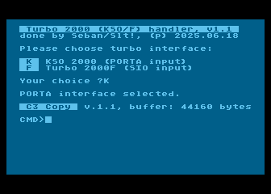
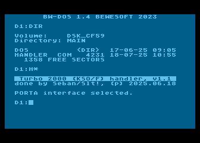
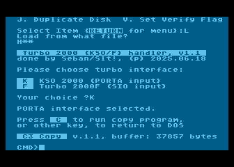

# T2K handler

T2K handler jest programem który po uruchomieniu instaluje w systemie urządzenie "T:", umożliwiające zapis i odczyt plików w systemie turbo zgodnym zarówno z [KSO Turbo 2000](http://atariki.krap.pl/index.php/KSO_Turbo_2000) jak i [Turbo 2000F/Turbo 2001](http://atariki.krap.pl/index.php/Turbo_2000F). Handler instaluje się "pod systemem operacyjnym", co oznacza że będzie on współpracował jedynie załadowany spod systemów nie wykorzystujących pamięci "pod systemem operacyjnym", w pakiecie dostarczane są obrazy dyskietek (ATR) zawierające handler zintegrowany z [BW-DOS](http://atariki.krap.pl/index.php/BW-DOS) jak i [MyDOS](http://atariki.krap.pl/index.php/MyDOS).

Zachowanie sterownika (handler-a) jest zależne od sposobu ładowania go do pamięci komputera. Rozpatrzymy tutaj trzy przypadki:

1) **bezpośrednie załadowanie pliku .XEX do pamięci komputera bez DOS** (np. z użyciem emulatora, AVG Cart, etc.)  
   w takim wypadku handler po załadowaniu zada użytkownikowi pytanie dotyczące wyboru interfejsu z którego będzie domyślnie następował odczyt lub zapis danych, po wyborze interfejsu zostanie uruchomiony program "[C3 Copy](#c3-copy)", który umożliwi operacje kopiowania danych z wykorzystaniem załadowanego sterownika "T:".

   

2) **Załadowanie sterownika z poziomu BW-DOS**  
   sterownik załaduje się do pamięci, po czym wybierze domyślny interfejs odczytu danych (tzn. KSO Turbo 2000, a więc odczyt z PORTA), a następnie wróci do wiersza poleceń DOS, pozostawiając w systemie zainstalowane urządzenie "T:".  

   Sterownik rozpoznaje fakt ładowania go z poziomu BW-DOS i wtedy interpretuje parametry przekazane mu z linii komend, a są to:  

   `/F` - wybór interfejsu Turbo 2000F/AST/ATT/UM (odczyt z DATA_IN/SIO)  
   `/K` - wybór interfejsu KSO Turbo 2000 (odczyt z PORTA)  
   `/U` - odinstalowanie sterownika i usunięcie go z pamięci  

    

3) **Załadowanie sterownika z poziomu MyDOS**  
   Ponieważ nie wszystkie DOS-y dla Atari umożliwiają przekazywanie parametrów z linii komend, sterownik rozpoznaje sytuację w której nie jest ładowany z poziomu BW-DOS i w takim wypadku po uruchomieniu użytkownikowi zostaje zadane pytanie o wybór interfejsu z którego będzie sterownik korzystał, dodatkowo jeżeli w pamięci będzie znajdował się jakikolwiek DOS (wartość MEMLO większa niż $0700), użytkownikowi zostanie zadane pytanie czy uruchomić "C3 Copy", czy też sterownik ma wrócić do systemu DOS, pozostając rezydentnym.

    

## Składnia i semantyka nazw plików

Używając sterownika urządzenia T: i otwierając plik do odczytu (lub zapisu) używając znaków specjalnych możemy wpływać na zachowanie się sterownika, zacznijmy od specyfikacji numeru urządzenia.

jeżeli otworzymy urządzenie:

`T:` lub `T1:` to sterownik będzie czytał z interfejsu turbo wybranego przez użytkownika (załóżmy że jest to KSO Turbo 2000, czyli interfejs turbo podpięty pod drugi port joysticka - fizycznie w komputerze jest to `PORTA` układu PIA), gdyby jednak użytkownik nagle zechciał czytać z interface turbo korzystającego z linii DATA_IN portu SIO, wystarczy że użyje urządzenia `T2:`, wtedy zostanie wybrany drugi (alternatywny do wybranego wcześniej) interfejs turbo, czyli jeżeli podczas ładowania sterownika został wybrany interfejs KSO (`PORTA`), to odwołanie to T2: będzie korzystało z `DATA_IN/SIO`, natomiast jeżeli przy ładowaniu sterownika został wybrany interface `DATA_IN/SIO` to odwołanie do T2: będzie powodowało że sterownik będzie operował na interfejsie podpiętym pod `PORTA` (drugi port joysticka), w tym wypadku odwołanie do "T:" czy też "T1:", będzie powodowało odczyt z `DATA_IN/SIO` wybranego przy starcie sterownika.

Wskazówka: W zależności od używanego przez sterownik interfejsu turbo, kolor pasków widocznych podczas odczytu/zapisu będzie odmienny (umożliwia to szybkie zorientowanie się który z interfejsów jest aktualnie używany)

Teraz dwa słowa o znakach specjalnych możliwych do użycia przy otwieraniu pliku do odczytu, tutaj starałem się zachować zgodność z standardem przyjętym w tej serii systemów turbo, tzn:

`*` - oznacza że gdy sterownik napotka rekord z nazwą pliku, to ją wyświetli i zapyta się czy akceptujemy ten plik jako plik do odczytu, np. gdy z poziomu C3 Copy wydamy polecenie:

`LOAD "T:*"`

i sterownik znajdzie rekord z nazwą pliku, to zobaczymy np.

`RIVERRAID [Y/N]?`

gdy użytkownik odpowie twierdząco, ładowanie programu do bufora/pamięci zostanie rozpoczęte, odpowiedź przecząca spowoduje że sterownik będzie poszukiwał następnego zbioru na taśmie.

**UWAGA !!!** Ze względu na fakt iż polecenie `COPY` z BW-DOS, gdy tylko znajdzie w nazwie specyfikowanego pliku symbol `*`, próbuje natychmiast wykonać operację poszukiwania zbioru w katalogu (GET/READ DIRECTORY - a to na urządzeniu taśmowym jest niemożliwe do zrealizowania), to wprowadzono dodatkową możliwość użycia znaku `/` który jest tożsamy z użyciem `*`, to powoduje że polecenie `COPY` z BW-DOS bez problemu skopiuje plik, np:

`COPY T:/ D:FOOBAR.BIN` - poprawnie skopiuje plik (bez próby wykonania katalogu z urządzenia taśmowego). Należy dodać że ten problem nie dotyczy MyDOS. Tam można normalnie używać `*`. Problem nie występuje również w innych programach które chciałby korzystać z `T:` pod BW-DOS, to po prostu specyfika polecenia `COPY` zaimplementowanego w BW-DOS.

`@` - oznacza że sterownik zaakceptuje pierwszą napotkaną nazwę i zacznie wczytywać bez pytanie pierwszy napotkany zbiór identyfikujący się poprawnym blokiem nazwy.

`?` Użycie tego symbolu powoduje, że w miejscu jego wystąpienia zostanie zaakceptowany dowolny znak znajdujący się w nazwie na danej pozycji.Przykładowo, podczas otwierania kanału z użyciem maski `"T:PIC???.MIC"`, sterownik będzie akceptował nazwy rozpoczynające się od `"PIC"`, po których mogą wystąpić trzy dowolne znaki. Następnie wymagana jest sekwencja znaków `".MIC"`, aby zbiór został otwarty.

## Trochę historii i technikalia

Oryginalna wersja handlera, której używałem jeszcze w latach '90, była początkowo typowym "dirty hackiem", który bazował na wersji Turbo 2000F, która ładowała się "pod ROM". W późniejszym czasie dokonałem ręcznej dezasemblacji tego kodu i nieco zmieniłem kod, tak aby dostosować go do moich potrzeb (możliwość odczytu z interfejsu KSO Turbo 2000, podłączanego pod drugi port joysticka, zmiana ilości impulsów synchro wymaganych do poprawnego rozpoznania początku bloku, zmniejszenie czasu oczekiwania po odczycie rekordu, drobne optymalizacje kodu, etc.).

Obecna wersja została przeniesiona z formatu Quick Assembler do formatu, który jest strawny dla [XASM](https://github.com/pfusik/xasm), można ją więc bez problemu kompilować chociażby na PC. Kod został wzbogacony o komentarze i poddany dalszym drobnym optymalizacjom, dodano możliwość wyboru interfejsu, z którego będzie następował odczyt danych; może to być oczywiście PORTA (interfejs zgodny z KSO Turbo 2000) lub linia DATA_IN portu SIO (interfejs zgodny z Turbo 2000F/2001/AST/ATT/UM).

W przypadku wybrania przez użytkownika odczytu danych za pomocą DATA_IN/SIO, procedury odczytu dokonują również sterowania linią COMMAND portu SIO w czasie odczytu, co aktywuje interfejsy zgodne z AST/ATT/UM czy tzw. "Wrocławskim Turbo 2000". Za pomocą tychże interfejsów powinien być możliwy odczyt danych z kaset w standardowych formatach Turbo 2000, bazujących na rozwiązaniach W.Zabołotnego (np. [Turbo 2T06](http://atariki.krap.pl/index.php/Turbo_2T06) i późniejsze).

Obszary w które ładuje się handler i które wykorzystuje do swoich potrzeb to:

* `$0480-$04FF` - procedury i bufory pomocnicze
* `$CC00-$CFFF` - kod sterownika
* `$D800-$E3FF` - bufor na rekord danych (3072 bajty)

## C3 Copy

Program `C3 Copy` zintegrowany ze sterownikiem `T:` to rozwinięcie idei która powstała jeszcze w czasach kiedy istniało Code3, zalążki kodu które wtedy powstały nie nadawały się do ponownego użycia, więc na potrzeby tego projektu postanowiłem napisać wszystko od nowa. Zadaniem tego programu jest wspomóc proces kopiowania zbiorów z taśm na dyskietki czy też dysk twardy, program ma niewielki bufor (około 38 kilobajtów, gdy program zostanie uruchomiony spod DOS lub około 44 kB gdy uruchomimy program bez DOS) jednak to nie w większości wypadków większego znaczenia, ponieważ sposób działania programu jest taki, że kopiuje on dane porcjami. W przypadku gdy użyjemy wbudowanego polecenia `COPY`, oraz gdy program wykryje że plik źródłowy będzie odczytywany z urządzenia `T:`, zaczyna kopiować dane porcjami (po 3072 bajty, co odpowiada rozmiarowi rekordu danych w systemach serii Turbo 2000), tzn. każdy odczytany rekord zostaje natychmiastowo zapisany na urządzenie docelowe (dysk, ram-dysk czy też dysk twardy). Wielkość wewnętrznego bufora programu na znaczenie jedynie wtedy gdy używamy poleceń `LOAD` lub `SAVE`, które służą do wczytania wskazanego zbioru, w całości do pamięci. Ma to zastosowanie jedynie wtedy gdy chcemy odczytać zbiory z taśmy zapisane w standardzie (urządzenie `C:`), i tylko tylko wtedy zbiór jest zapisany z krótkimi przerwami między rekordami, wtedy nie jest możliwe zatrzymanie silnika magnetofonu po każdym rekordzie wczytanym do bufora, gdyż ponowne włączenia silnika i próba odczytu skończy się niepowodzeniem ze względu na dużą bezwładność mechanizmu magnetofonu. Zatem polecenia `LOAD`/`SAVE` zostały dodane aby ułatwić odczyt zbiorów zapisanych w standardzie (np. loader-ów poprzedzających zapisane w turbo programy, lub prostych programów i gier typu [BOOT](http://atariki.krap.pl/index.php/BOOT_%28format_pliku%29), czy też programów zapisanych 

### Spis poleceń programu `C3 Copy`

* `HELP`, `?` - wyświetla spis dostępnych poleceń obsługiwanych przez program.
* `DOS` - powoduje powrót do DOS.
* `BYE` - wymusza zimy start systemu (Cold BOOT)
* 'MEM' - wyświetla informację dotyczące pamięci dostępnej dla programu (rozmiar bufora oraz aktualne wartości Mem-Lo oraz Mem-Hi, pomiędzy .którymi znajduje się bufor wykorzystywany przez program)
* 'BUF' - wyświetla informacje o długości danych wczytanych do bufora przez polecenie `LOAD`.
* `CLS` - czyści ekran.
* `DIR` - wyświetla katalog dysku. W przypadku braku urządzenia z którego ma być wyświetlony katalog, wyświetla katalog domyślnego urządzenia, czyli `DIR D:*.*`, możliwe jest wyświetlenie katalogu dowolnego urządzenia z podaną maską plików, np. `DIR H1:*.XEX`, spowoduje wyświetlenie wszystkich plików .XEX znajdujących się na dysku H1:
* `DEV` - wyświetla listę urządzeń zainstalowanych w systemie, dodatkowo jest wyświetlany adres tablicy zawierającej wektory obsługi urządzenia.
* `LOAD` lub `L` - spowoduje załadowanie wskazanego pliku do bufora w pamięci programu, np. `LOAD H:TBXL.XEX` spowoduje załadowanie pliku `TBXL.XEX` z urządzenia `H:` do bufora programu. W przypadku użycia polecenia `LOAD` ze standardowym sterownikiem magnetofonu `C:` plik zostanie otwarty do odczytu w trybie z krótkimi przerwami między rekordami.
* `SAVE` lub `S` - spowoduje zapisanie pliku zawartego w buforze na wskazane urządzenie, np. `SAVE T:TBXL.XEX` spowoduje zapisanie pliku `TBXL.XEX` na urządzenie `T:` (czyli zapis pliku na magnetofon w systemie Turbo 2000). Tak samo jak w przypadku polecenie `LOAD`, gdy w poleceniu `SAVE` zostanie wybrane urządzenie `C:` jako docelowe, to na taśmie rozpocznie się zapis pliku z krótkimi przerwami między rekordami.
* `DUMP` lub `D` - jeżeli w buforze wejściowym znajdują się jakiekolwiek dane polecenie dump rozpocznie wyświetlenie bufora od adresu 0, w formacie HEX oraz ATASCII (po osiem wartości w HEX/ATASCII w wierszu). Operację wyświetlania można przerwać używając klawisza `ESC`.
* `COPY` lub `CP` - to polecenie umożliwia kopiowanie plików pomiędzy dowolnymi urządzeniami dostępnymi w systemie, jego składnia jest prosta `COPY urządzenie:plik_źródłowy urządzenie:plik_docelowy`, czyli np. polecenie `COPY T:* D8:HT89.COM`, spowoduje otwarcie urządzenia `T:`, po czym sterownik urządzenia `T:` zacznie poszukiwać bloku zawierającego nazwę pliku, gdy ją odnajdzie i użytkownik potwierdzi wybór odnalezionego pliku, rozpocznie się operacja kopiowania. kopiowanie będzie się odbywało w blokach po 3072 bajty, zatem długość pliku nie ma znaczenia, gdyż kopiowanie i tak porcjami. Po poprawnie zakończonej operacji kopiowania, na ram-dysku (D8:) znajdzie się plik `HT89.COM`.

### Q&A

1) **Dlaczego podczas operacji I/O z użyciem urządzenia `T:` widzę "śmieci", na ekranie (zaburzony wygląd wyświetlanych znaków) ?**

   Jest to spowodowane faktem używania przez sterownik pamięci RAM "schowanej" pod systemem operacyjnym, w pamięci ROM komputera, znajduje się również obszar w którym znajdują się definicje "fontów" systemowych, każde odwołanie do sterownika wymusza konieczność odłączenia pamięci ROM (aby w to miejsce zmapować RAM). Ta operacja powoduje że ANTIC pobierając wygląd znaków, nie odczytuje jego zawartości z pamięci ROM, a wyświetla zamiast klasycznego wyglądu znaków, to co aktualnie znajduje się w pamięci RAM (dokładniej w obszarze $E000-$E3FF), a właśnie w tym obszarze znajduje się bufor rekordu danych dla systemu turbo, zatem wygląd śmieci zastępujących systemowy generator znaków jest zależny od tego co aktualnie wylądowało w buforze rekordu, czyli widać to co akurat zostało odczytane lub ma być zapisane do/z na taśmie.

2) **Dlaczego kod sterownika zrobiono w taki sposób aby wykorzystywał pamięć pod OS-ROM, czy nie mógłby on korzystać z normalnej pamięci komputera?**

   Takie rozwiązanie nie jest być może zbyt eleganckie, ale umożliwiło w prosty sposób koegzystowanie sterownika urządzenia `T:` w obecności urządzenia `D:` które zapewnia załadowany system DOS, który to zazwyczaj ładuje się na sam dół pamięci (począwszy od adresu `$0700`). Dzięki takiemu założeniu, handler nie musi się relokować w obszar tuż powyżej MEMLO (który jest zależny od załadowanego DOS-a i jego konfiguracji). Co prawda powoduje to że ten sterownik nie będzie działał z DOS-ami które również lokują się pod systemem operacyjnym, ale dzięki temu maksymalizujemy rozmiar dostępnej pamięci dla pozostałych programów (chociażby `C3 Copy`, `ATARI BASIC`, etc.). W praktyce załadowanie sterownika nie zmienia ani MEMLO ani MEMTOP. Zarówno BW-DOS jak i MyDOS nie korzystają z pamięci pod OS-ROM i działają ze sterownikiem `T:` bez problemów.

3) **Z jakimi DOS-ami działa sterownik?**

   Sterownik przetestowano tylko i wyłącznie z BW-DOS oraz MyDOS, powinien jednak działać również z DOS-ami które nie wykorzystują pamięci pod OS-ROM i takimi które szanują istniejące wpisy w tablicy sterowników urządzeń (`HTABS`). Niektóre wersje DOS-ów, zamiast skorzystać z wbudowanego w system operacyjny mechanizmu dodawania urządzeń do tablicy `HTABS`, po prostu wpisują się na z góry ustalone miejsce nie respektując możliwości że w tym miejscu znajduje się już inny sterownik urządzenia.

   Sterownik na pewno nie będzie działał z DOS-ami które również wykorzystują pamięć od OS-ROM dla swoich potrzeb (np. SuperDos, niektóre wersje BiboDOS).

   Sterownik powinien również działać ze `SpartaDOS 3.2`, ale tej opcji nie sprawdzono. Jeżeli zgodność `BW-DOS` ze `SpartaDOS` jest wystarczające, są to przesłanki do tego aby sądzić że wersja SpartaDOS które nie rezydują pod `OS-ROM` również powinny działać.

4) **Dlaczego handler nie współpracuje z systemem QMEG?**

   Jak wspominałem wcześniej, to rozwiązanie początkowo powstało jako adaptacja bazująca na wersji systemu Turbo 2000F siedzącej pod OS-ROM, także sam sterownik nie współpracuje poprawnie z systemem QMEG ponieważ ze względu na uproszczenia i minimalizację obszaru pamięci zajmowanej poniżej MEMTOP, następuje kolizja z pewnymi mechanizmami zawartymi w samym QMEG. Sam QMEG-OS również nie zawiera niektórych procedur oryginalnie zawarty w ATARI OS-ROM, przez co handler nie może poprawnie działać, z tego własnie powodu sterownik wykrywa obecność systemu QMEG i żąda jego wyłączenia, gdy stwierdzi jego obecność.

5) **W dokumentacji i/lub sterowniku jest nieścisłość lub błąd? Co robić?**

   Ten projekt powstawał w dość dużym pośpiechu (w szczególności dokumentacja). Jeżeli widzisz jakąś nieścisłość lub błąd, daj proszę znać, co mogę poprawić. Będę się starał to robić w miarę możliwości czasowych.

### Programy i projekty które wspomogły i ułatwiły powstanie tego programu:

* [XASM](https://github.com/pfusik/xasm)
* [MKATR](https://github.com/dmsc/mkatr)
* [Atari Tools](https://github.com/jhallen/atari-tools)
* [XEDISK](https://github.com/epi/xedisk)
* BW-DOS
   * [Original BW-DOS sources](https://github.com/dmsc/bwdos-original)
   * [DMSC's optimized version](https://github.com/dmsc/bwdos-mads)
   * [HolgerJanz BW-DOS repository](https://github.com/HolgerJanz/BW-DOS)
* [MYDOS](https://www.mathyvannisselroy.nl/mydos.htm)

## LICENCJA

Jest to wolne i niezobowiązujące oprogramowanie udostępnione do domeny publicznej.

Każdy może kopiować, modyfikować, publikować, używać, kompilować, sprzedawać lub rozpowszechniać to oprogramowanie, zarówno w formie kodu źródłowego, jak i skompilowanego binarnego, do dowolnego celu — komercyjnego lub niekomercyjnego — oraz w dowolny sposób.

W jurysdykcjach uznających prawa autorskie, autor lub autorzy tego oprogramowania zrzekają się wszelkich praw autorskich do tego oprogramowania na rzecz domeny publicznej. Dokonujemy tego z korzyścią dla społeczeństwa i ze szkodą dla naszych spadkobierców i następców. Zamierzamy, by było to jawne i nieodwołalne zrzeczenie się wszelkich obecnych i przyszłych praw autorskich do tego oprogramowania.

**OPROGRAMOWANIE JEST DOSTARCZANE „TAK JAK JEST”, BEZ JAKIEJKOLWIEK GWARANCJI, WYRAŹNEJ LUB DOROZUMIANEJ, W TYM MIĘDZY INNYMI GWARANCJI PRZYDATNOŚCI HANDLOWEJ, PRZYDATNOŚCI DO OKREŚLONEGO CELU ORAZ NIENARUSZANIA PRAW.**

W ŻADNYM WYPADKU AUTORZY NIE PONOSZĄ ODPOWIEDZIALNOŚCI ZA ŻADNE ROSZCZENIA, SZKODY LUB INNE ZOBOWIĄZANIA, CZY TO NA PODSTAWIE UMOWY, DELIKTU LUB INNEJ PODSTAWY, POWSTAŁE W ZWIĄZKU Z OPROGRAMOWANIEM LUB JEGO UŻYTKOWANIEM.

Więcej informacji znajdziesz na: <https://unlicense.org/>

## LICENSE

This is free and unencumbered software released into the public domain.

Anyone is free to copy, modify, publish, use, compile, sell, or
distribute this software, either in source code form or as a compiled
binary, for any purpose, commercial or non-commercial, and by any
means.

In jurisdictions that recognize copyright laws, the author or authors
of this software dedicate any and all copyright interest in the
software to the public domain. We make this dedication for the benefit
of the public at large and to the detriment of our heirs and
successors. We intend this dedication to be an overt act of
relinquishment in perpetuity of all present and future rights to this
software under copyright law.

THE SOFTWARE IS PROVIDED "AS IS", WITHOUT WARRANTY OF ANY KIND,
EXPRESS OR IMPLIED, INCLUDING BUT NOT LIMITED TO THE WARRANTIES OF
MERCHANTABILITY, FITNESS FOR A PARTICULAR PURPOSE AND NONINFRINGEMENT.
IN NO EVENT SHALL THE AUTHORS BE LIABLE FOR ANY CLAIM, DAMAGES OR
OTHER LIABILITY, WHETHER IN AN ACTION OF CONTRACT, TORT OR OTHERWISE,
ARISING FROM, OUT OF OR IN CONNECTION WITH THE SOFTWARE OR THE USE OR
OTHER DEALINGS IN THE SOFTWARE.

For more information, please refer to <https://unlicense.org/>
